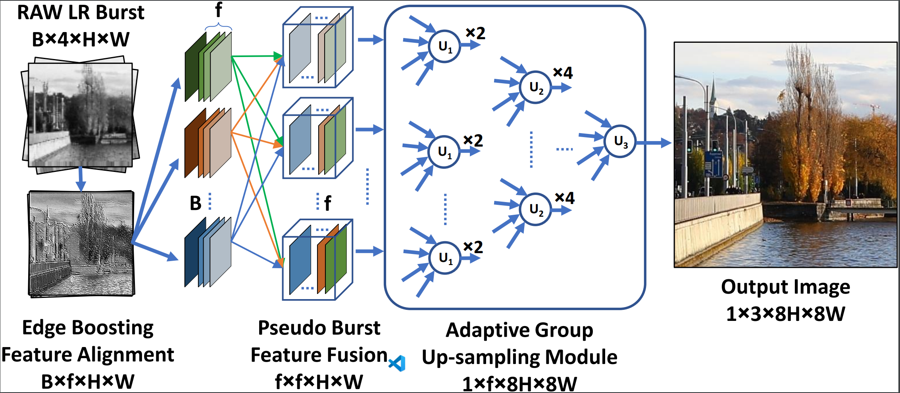

# Burst Image Restoration and Enhancement (CVPR 2022 -- Oral)

[Akshay Dudhane](https://scholar.google.com/citations?user=BG_XEmkAAAAJ&hl=en), [Syed Waqas Zamir](https://scholar.google.es/citations?user=WNGPkVQAAAAJ&hl=en), [Salman Khan](https://salman-h-khan.github.io/), [Fahad Shahbaz Khan](https://scholar.google.es/citations?user=zvaeYnUAAAAJ&hl=en), and [Ming-Hsuan Yang](https://scholar.google.com/citations?user=p9-ohHsAAAAJ&hl=en)

[](https://arxiv.org/abs/2110.03680)
[](https://mbzuaiac-my.sharepoint.com/:b:/g/personal/akshay_dudhane_mbzuai_ac_ae/EZgPZBPNqUZDpeBtmh4MQvUBmvspLo8iy2SuovNuswH0Nw?e=Il33lg)


#### News
- **June 22, 2022:** BIPNet oral presentation is available [here](https://mbzuaiac-my.sharepoint.com/:v:/g/personal/akshay_dudhane_mbzuai_ac_ae/EaZQu17BqjVEuSBSPdxZ8hEB5a-HH4HcD34PXm7PhP3SYw?e=uRGd16)
- **June 21, 2022:** BIPNet was best paper finalist at CVPR 2022  :fire:
- **April 3, 2022:** Training and Testing codes with pre-trained models are released :fire:
- **March 29, 2022:** BIPNet is selected for an ORAL presentation at CVPR 2022 :dizzy:
- **March 3, 2022:** Paper accepted at CVPR 2022 :tada: 

<hr />

> **Abstract:** *Modern handheld devices can acquire burst image sequence in a quick succession. However, the individual acquired frames suffer from multiple degradations and are misaligned due to camera shake and object motions. The goal of Burst Image Restoration is to effectively combine
complimentary cues across multiple burst frames to generate high-quality outputs. Towards this goal, we develop a novel approach by solely focusing on the effective information exchange between burst frames, such that the degradations get filtered out while the actual scene details are preserved and enhanced. Our central idea is to create a set of pseudo-burst features that combine complimentary information from all the input burst frames to
seamlessly exchange information. However, the pseudo burst cannot be successfully created unless the individual burst frames are properly aligned to discount interframe movements. Therefore, our approach initially extracts pre-processed features from each burst frame and matches them using an edge-boosting burst alignment module. The pseudo-burst features are then created and enriched using multi-scale contextual information. Our final step is to adaptively aggregate information from the pseudo-burst features to progressively increase resolution in multiple stages while merging the pseudo-burst features. In comparison to existing works that usually follow a late fusion scheme with single-stage upsampling, our approach performs favorably, delivering state-of-the-art performance on burst super-resolution, burst low-light image enhancement and burst denoising tasks.* 
<hr />

## Network Architecture

 

## Installation

See [install.yml](install.yml) for the installation of dependencies required to run Restormer.
```
conda env create -f install.yml
```

## Citation
If you use BIPNet, please consider citing:
    
    @inproceedings{dudhane2021burst,
            title={Burst Image Restoration and Enhancement},
            author={Akshay Dudhane and Syed Waqas Zamir and Salman Khan and Fahad Shahbaz Khan and Ming-Hsuan Yang},
            booktitle={CVPR},
            year={2022}
          }


## Contact
Should you have any question, please contact akshay.dudhane@mbzuai.ac.ae


**Acknowledgment:** This code is based on the [NTIRE21_BURSTSR](https://github.com/goutamgmb/NTIRE21_BURSTSR) toolbox.
